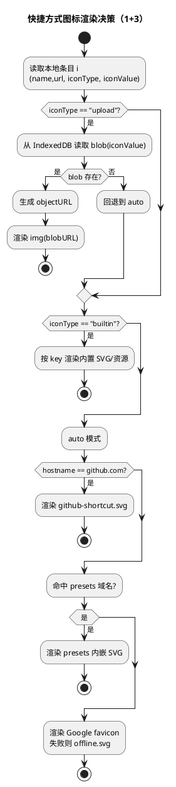

# 2026-03-26 删除随机壁纸 + 快捷方式自定义图标与显示名（设计）

## 背景与目标

本次改动包含两部分：

- **删除随机壁纸功能**：移除“从外部 API 获取随机壁纸”的入口与逻辑，同时清理相关隐私政策说明，避免继续发起不必要的网络请求。
- **快捷方式增强**：快捷方式编辑能力扩展为 **可修改显示名称**（现状已支持，补齐“显示名称”的语义与 UI 文案）以及 **可自定义图标**（支持“内置图标库选择 + 上传图片”两种方式，并保留“自动按网址取图标”的回退）。

## 范围（Scope）

### 删除随机壁纸

- **UI**：移除 `index.html` 中随机壁纸按钮（`#randomImageTrigger`）。
- **逻辑**：移除 `scripts/wallpaper.js` 中随机壁纸抓取与每日刷新相关逻辑（`applyRandomImage`、`RANDOM_IMAGE_URL`、`imageType=random` 分支等）。
- **合规**：更新 `privacy-policy.html`，删除 Random Wallpapers（Lorem Picsum）相关条目。
- **数据兼容**：处理 IndexedDB 里历史遗留的“random 类型背景图”数据，避免继续被当作有效背景复用。

### 快捷方式自定义图标 + 显示名称

- **显示名称**：沿用现有 `shortcutName{i}` 的存储与渲染，但在设置页将概念明确为“显示名称”。
- **自定义图标**：
  - **方式 1（内置图标库）**：从预置 SVG（以及 `svgs/` 目录内可用资源）中选择。
  - **方式 3（上传图片）**：从本地选择图片，保存并作为快捷方式图标展示。
  - **回退策略**：若未配置自定义图标，则沿用当前逻辑（GitHub 特判 / presets 内嵌 SVG / Google Favicon API / offline.svg）。

## 现状梳理（代码事实）

### 随机壁纸

- 随机壁纸通过 `https://picsum.photos/1920/1080` 获取，存入 IndexedDB：`ImageDB` / `backgroundImages`，并额外保存：
  - `lastUpdateTime`
  - `imageType` = `random | upload`
- `index.html` 中存在 `#randomImageTrigger` 按钮绑定到 `applyRandomImage`。
- `privacy-policy.html` 明确列出 Random Wallpapers（Lorem Picsum）为 External APIs。

### 快捷方式

- 快捷方式“名称/URL”存储于 localStorage：
  - `shortcutAmount`
  - `shortcutName{i}` / `shortcutURL{i}`
- 主界面渲染时，图标策略为：
  1. GitHub → `./svgs/github-shortcut.svg`
  2. 命中 presets 域名 → 使用内嵌 SVG
  3. 否则 → Google favicon API（失败回退到 `./svgs/offline.svg`）

## 设计方案

### A. 删除随机壁纸（完整移除）

#### A1. UI 改动

- 删除 `index.html` 中随机壁纸按钮（`<button id="randomImageTrigger">`）。
- 上传壁纸（`#uploadTrigger`）与清除（`#clearImage`）保留不变。

#### A2. 逻辑改动

- `scripts/wallpaper.js` 中删除：
  - `RANDOM_IMAGE_URL`
  - `applyRandomImage(...)`
  - `document.getElementById("randomImageTrigger").addEventListener(...)`
  - `checkAndUpdateImage()` 中对 `imageType === "random"` 的逻辑分支
- 保留上传壁纸逻辑与 IndexedDB 存储（仅支持 `upload` 类型）。

#### A3. 数据兼容策略（IndexedDB）

目标：用户升级后不再沿用历史随机图缓存，且不再触发网络请求。

- 启动时读取到 `imageType === "random"`：
  - **直接清理**：删除 `backgroundImage` / `lastUpdateTime` / `imageType` 三个键，并把 UI 切回 `data-bg="color"`（等价“未设置壁纸”）。
- 读取到 `imageType === "upload"`：正常应用。
- 读取到无数据/异常：正常回退为纯色背景。

#### A4. 隐私政策

- 从 `privacy-policy.html` 的 External APIs 列表中移除 Random Wallpapers（Lorem Picsum）条目。

---

### B. 快捷方式：显示名称 + 自定义图标（1+3）

#### B1. 数据模型（概念）

每个快捷方式条目：

- `name`：显示名称（现有字段）
- `url`：链接（现有字段）
- `icon`：新增（可选）
  - `type`: `"auto" | "builtin" | "upload"`
  - `value`: 当 `builtin` 时为内置图标 key；当 `upload` 时为上传图标的存储 key（不直接存 base64 在 localStorage）

#### B2. 持久化设计

继续保持“每条 entry 一个 index”的存储方式，新增键：

- `shortcutIconType{i}`：`auto | builtin | upload`
- `shortcutIconValue{i}`：
  - `builtin`：例如 `youtube` / `gmail` / `github` / `custom_svg_XXX`
  - `upload`：例如 `shortcutIconUpload:{uuid}`（用于 IndexedDB key）

上传图标数据存储建议使用 IndexedDB（避免 localStorage 容量与性能问题）：

- DB：`ShortcutIconDB`
- Store：`shortcutIcons`
- Key：`shortcutIconUpload:{uuid}`
- Value：图片 Blob（或经过缩放后的 Blob）

#### B3. 渲染优先级（图标决策）

渲染图标时：

1. **upload**：从 IndexedDB 取 Blob → `URL.createObjectURL(blob)` → ``
2. **builtin**：按 key 渲染内置 SVG 或 `svgs/` 资源
3. **auto**：沿用现有策略（GitHub / presets / Google favicon / offline）

#### B4. 编辑页 UI（交互）

在每条 `shortcutSettingsEntry` 内新增“图标设置区”，包含：

- 图标模式选择（单选）：
  - 自动
  - 内置
  - 上传
- 内置图标选择器：
  - 下拉或网格（优先轻量实现：下拉 + 小预览）
- 上传入口：
  - file input（accept image/*）
  - 上传后立即预览，并持久化

显示名称字段现有是 `input.shortcutName`，UI 文案调整为“显示名称”。

#### B5. 拖拽排序 / 删除 / 重置的兼容

需要确保以下操作同时维护新增 icon 字段：

- **拖拽排序**：保存顺序时，必须把 `iconType/iconValue` 一起纳入 `newOrder`。
- **删除**：删除某条 shortcut 时：
  - localStorage 键向前搬移时，同步搬移 icon 键
  - 如果被删除项是 upload 图标，需删除 IndexedDB 对应 blob（避免垃圾数据）
- **重置**：清空 `shortcutIconType{i}` / `shortcutIconValue{i}`，并清空 `ShortcutIconDB`（或遍历删除所有 keys）。

## 流程图（PlantUML）

## 验收标准（Definition of Done）

- **随机壁纸**：
  - 设置中不再出现随机壁纸按钮
  - 不再访问 `picsum.photos`
  - 隐私政策不再声明 Random Wallpapers API
  - 历史随机壁纸缓存不会继续生效（升级后自动清理）
- **快捷方式**：
  - 每条快捷方式可修改“显示名称”（保留现有能力，文案一致）
  - 每条快捷方式可选择内置图标或上传图标
  - 未设置时维持现有自动取图标策略
  - 拖拽排序 / 新增 / 删除 / 重置均不会丢失或串错图标配置

## 风险与约束

- **IndexedDB 兼容**：需要处理首次创建 DB 的 onupgradeneeded，避免旧浏览器异常。
- **性能**：上传图标应做尺寸限制（例如缩放到 128×128 或 192×192）以避免过大 blob 影响加载。
- **安全**：显示名称与 URL 仍需沿用现有的转义/规范化策略，图标上传仅作为本地 blob 展示。

